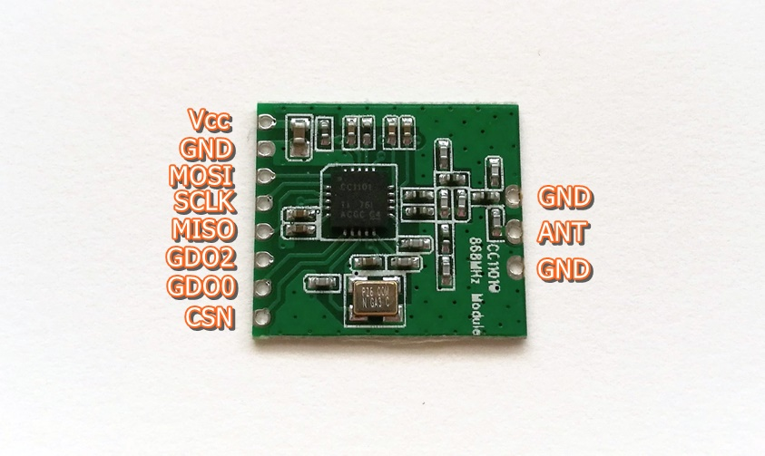
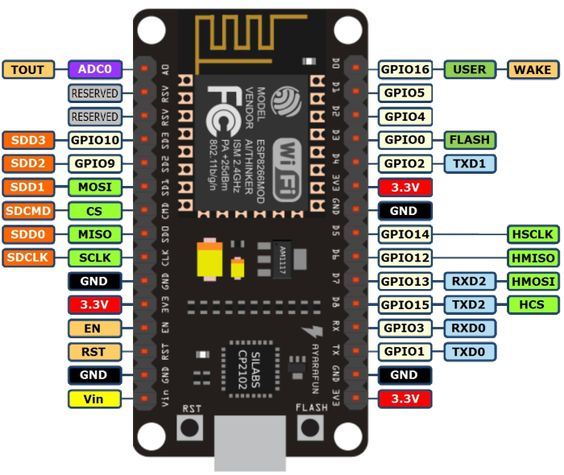

# espruino-cc1101-q7rf

Use a NodeMCU (ESP8266) and a TI CC1101 modem to control your Computherm/Delta Q7RF/Q8RF receiver equiped boiler via MQTT.

**Use this project at your own risk. I'm not responsible for any damage done by it. I haven't done any extensive testing with it. Bugs can cause unwanted behaviour and/or even damage your heating equipment. Please be careful with testing. Reporting and/or fixing issues is always welcome.**

## Hardware

You need Espruino firmware version 2v04.76 or later. Get it from www.espruino.com and flash accordingly. A 4MB Flash equiped NodeMCU is required. If you use other boards, you might need to change the different pin settings in `app.ts`.

You need a CC1101 chip which is tuned to 868 MHz. The chip on it's own can be configured for many targets, but the antenna design on the board needs to be tuned for the specific frequency in mind. I've used an extremely cheap $2 module from AliExpress which needed some cables and the antenna to be soldered.

CC1101 chip needs to be connected to the standard SPI pins of ESP8266 (secondary SPI PINs, the first set is used by the flash RAM module).

Connections:

    NODEMCU               CC1101
    ============================
    3.3V                  VCC
    GND                   GND
    D7 (GPIO13/HMOSI)     MOSI
    D5 (GPIO14/HSCLK)     SCLK
    D6 (GPIO12/HMISO)     MISO
    D8 (GPIO15/HCS)       CSN

## Setup and flash

In the project's directory create a copy of `config.template.js` as `config.js` and fill the necessary parameters.

Use `npm install` to get dependencies for this repository and then issue `npm run flash` to flash to the device. Probably you need to change the serial port used, this can be done in the `package.json` file, in the `flash` scripts's espruino command line arguments (default is `/dev/ttyUSB0` but you can use Windows style `COM1` as well).

Once flashed the device reboots and starts running the code. You can check the status over the USB serial connection (eg. using PuTTY or miniterm to connect to the serial port of the device, baud rate is 115200), but in case you don't have access to that, the NodeMCU's on board LED signals the different states:
* Slow blink (1 sec on-off): the device is initializing. If this takes too long probably you have a bad connection to the CC1101.
* Fast blink (0.5 sec on-off): there's some kind of error, like the CC1101 modem failed to initialize, or you have given bad WiFi credentials, check the serial output for errors.
* Rapid blinking (0.1 sec on-off): the device disconnected from the MQTT broker, it will try to reconnect in 10 seconds, but if the problem persists, check your MQTT server or the config.

## Device behaviour

Device will subscribe to the specified MQTT topic (`q7rf/heating` by default) and awaits commands from there. Messages are in plain text format. In your home automation system use these to trigger events.

* `ON` - turn the heating on
* `OFF` - turn the heating off

## Pairing with the receiver

Once the device settled you need to pair your device to the existing Computherm receiver. Press and hold the M/A button on the receiver until it starts flashing green. Now press the "Flash" button on your NodeMCU module. The receiver should stop blinking. The pairing is now completed.

If you wish to reset and use your original wireless thermostat, once again set the receiver into learning mode with the M/A button, then hold the SET + DAY button on your wireless thermostat until the blinking stops. The receiver only listens to the device currently paired.

In case you are operating multiple devices in the vicinity, you need to change the deviceId used inside the `config.js` file. This is a 16 bit value, so it's always 4 hexa characters long.

## Research sources

* The cc1101-ook library which functioned as a template for the communication best practices with the modem (https://github.com/martyrs/cc1101-ook)
* denx's awesome article series about reverse engineering the Q8RF's protocol. Unfortunatelly it's only
  available in Hungarian. (https://ardu.blog.hu/2019/04/17/computherm_q8rf_uj_kihivas_part)
* CC1101 product manual from Ti: http://www.ti.com/lit/ds/symlink/cc1101.pdf
* The Espruino Typescript definitions from Matias Gea's repository (https://github.com/mfgea/espruino-ts-boilerplate/tree/master/types/espruino). Also I've learned a lot about the Typescript compilation needed for this project from his repository. Unfortunatelly I don't know where he got the type definition from. It's more complete than the definition found inside DefinitelyTyped.
* The tinyMQTT module from the Espruino modules directory (https://www.espruino.com/tinyMQTT)
